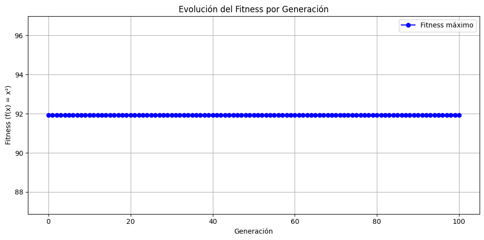
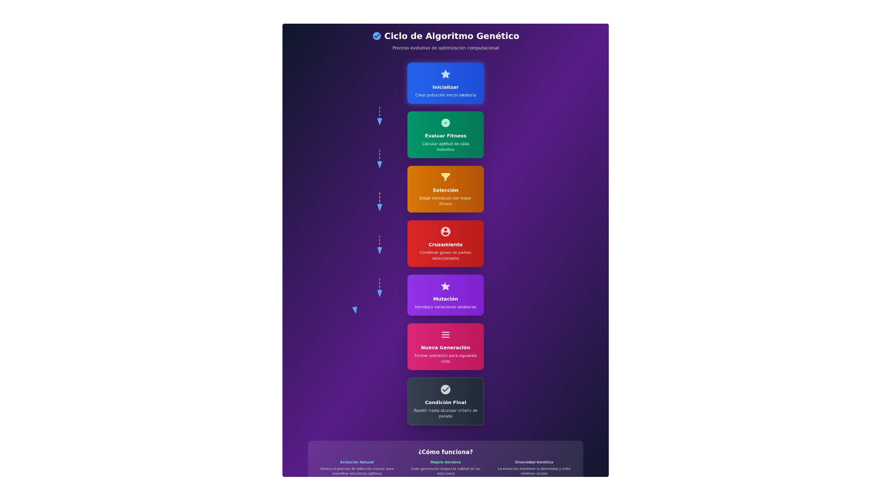

# 🧬 Algoritmo Genético en Python con PyGAD

> 🎓 **Proyecto educativo** que demuestra cómo usar un **Algoritmo Genético (AG)** para resolver un problema de optimización: **maximizar la función f(x) = x²**, utilizando la librería [PyGAD](https://github.com/ahmedfgad/GeneticAlgorithmPython).

---
## 🚀 Ejecuta el proyecto en Google Colab
Haz clic en el botón para abrir el notebook directamente:
[](https://colab.research.google.com/drive/1cGbgCMQdvobuCWQ89TX8ZPke7tZjXg_U?usp=sharing)

---
## 📌 Descripción general
Este proyecto simula un algoritmo genético con las siguientes características:
- **Función objetivo**: `f(x) = x²` (maximizar)
- **Población inicial aleatoria**
- **Selección** por ruleta y torneo



- **Cruzamiento** y **mutación aleatoria**
- **Visualización del fitness** por generación

Puedes ver la presentación del proyecto aquí: [Presentación de Algoritmos Genéticos](https://algoritmos-geneticos-y0xrm5k.gamma.site)

Además, puedes ver un video explicativo aquí: [Video de Algoritmos Genéticos](https://youtu.be/cR26zgRFcGM)

---
## ⚙️ Requisitos
Necesitas instalar las siguientes bibliotecas:
```bash
pip install pygad matplotlib
